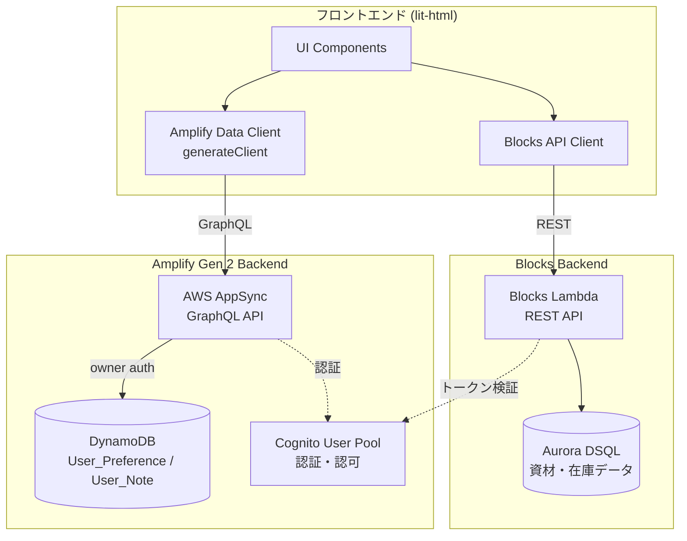
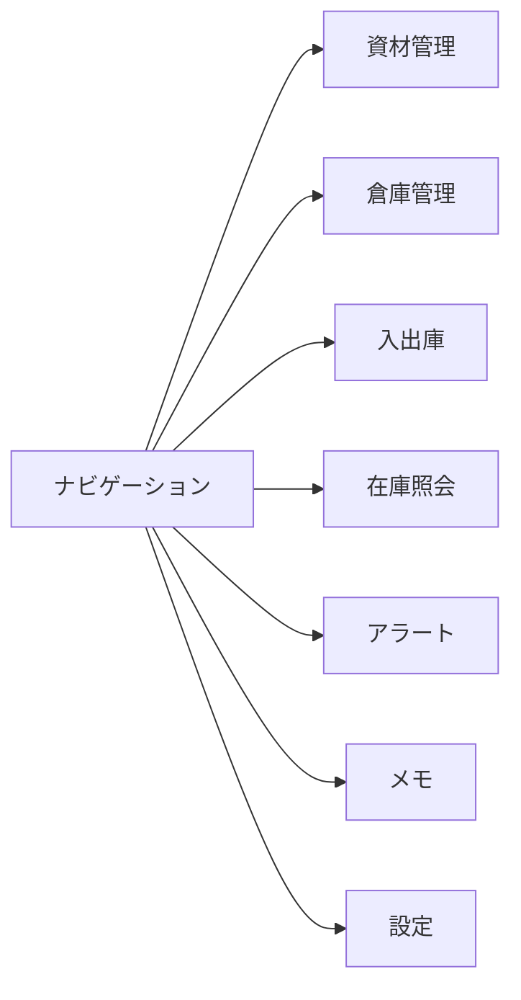

# Design Document: AppSync + DynamoDB ユーザーデータ管理

## Overview

既存の資材在庫管理システム（Blocks + Aurora DSQL）に、AWS AppSync + DynamoDB を用いたユーザー固有データ管理機能を追加する。Amplify Gen 2 の `defineData` API を使用してデータスキーマを TypeScript で定義し、owner 認可ルールによりユーザーごとのデータ分離を実現する。

本設計では以下を実現する:
- `amplify/data/resource.ts` にて `User_Preference` / `User_Note` モデルを定義
- `amplify/backend.ts` に data リソースを追加（既存 auth + Blocks との共存）
- フロントエンドで `generateClient()` を用いた型安全な GraphQL クライアントを構成
- 既存の lit-html ベースの UI にメモ・設定管理セクションを追加

## Architecture

### システム構成図



### 設計方針

1. **追加のみ（Additive Change）**: 既存の `amplify/backend.ts` と Blocks 統合は変更せず、`data` リソースの追加のみ行う
2. **Cognito 共有**: 既存の `amplify/auth/resource.ts` で定義済みの Cognito User Pool を AppSync の認証に再利用する
3. **クライアント分離**: Blocks API クライアントと Amplify Data クライアントは独立して動作し、同一ページで共存する
4. **Sandbox 互換**: `ampx sandbox` で AppSync + DynamoDB が自動プロビジョニングされ、ローカル開発可能

## Components and Interfaces

### 1. データスキーマ定義 (`amplify/data/resource.ts`)

新規ファイル。Amplify Gen 2 の `defineData` を使用してスキーマを定義する。

```typescript
import { type ClientSchema, a, defineData } from '@aws-amplify/backend';

const schema = a.schema({
  UserPreference: a
    .model({
      key: a.string().required(),
      value: a.string().required(),
    })
    .authorization((allow) => [allow.owner()]),

  UserNote: a
    .model({
      title: a.string().required(),
      content: a.string(),
    })
    .authorization((allow) => [allow.owner()]),
});

export type Schema = ClientSchema<typeof schema>;

export const data = defineData({
  schema,
  authorizationModes: {
    defaultAuthorizationMode: 'userPool',
  },
});
```

**設計判断:**
- `UserPreference` の key + owner の一意性は、アプリケーション層で upsert ロジックを実装して担保する（DynamoDB のプライマリキーは自動生成 ID のため）
- `UserNote` の `createdAt` / `updatedAt` は Amplify が自動付与するため明示的に定義しない
- `authorizationModes.defaultAuthorizationMode: 'userPool'` により、全操作で Cognito 認証を要求する

### 2. バックエンド定義更新 (`amplify/backend.ts`)

既存ファイルに `data` リソースを追加する。

```typescript
import { defineBackend } from '@aws-amplify/backend';
import { auth } from './auth/resource';
import { data } from './data/resource';
import { initBlocks } from './blocks.js';

export const backend = defineBackend({ auth, data });

await initBlocks(backend);
```

**設計判断:**
- `defineBackend` の引数に `data` を追加するのみ。`auth` と `initBlocks` は既存のまま
- Amplify が `amplify_outputs.json`（または `ampx_outputs.json`）に AppSync エンドポイント情報を自動出力

### 3. フロントエンド Amplify クライアント設定

`src/index.ts` のエントリポイントで Amplify を configure する。

```typescript
import { Amplify } from 'aws-amplify';
import outputs from '../amplify_outputs.json';

Amplify.configure(outputs);
```

**設計判断:**
- `amplify_outputs.json` には auth（Cognito）と data（AppSync）の両方の設定が含まれる
- 既存の `fetchAuthSession` ベースの Blocks ミドルウェアとは干渉しない（Amplify configure は同一プロセスで1回のみ呼び出す）

### 4. Data クライアント生成

```typescript
import { generateClient } from 'aws-amplify/data';
import type { Schema } from '../amplify/data/resource';

const dataClient = generateClient<Schema>();
```

**設計判断:**
- `generateClient<Schema>()` により完全な型安全性を確保
- userPool モードがデフォルトのため、ログイン済みユーザーの認証情報が自動的に付与される

### 5. UI コンポーネント構成

既存のナビゲーションに「メモ」「設定」セクションを追加する。



各セクションは既存パターン（lit-html テンプレート + 状態変数 + redraw 関数）に従って実装する。

## Data Models

### UserPreference

| フィールド | 型 | 必須 | 説明 |
|---|---|---|---|
| id | ID (自動生成) | Yes | DynamoDB プライマリキー |
| key | String | Yes | 設定キー（最大128文字） |
| value | String | Yes | 設定値（最大2048文字） |
| owner | String (自動設定) | Yes | Cognito ユーザー ID |
| createdAt | AWSDateTime (自動) | Yes | 作成日時 |
| updatedAt | AWSDateTime (自動) | Yes | 更新日時 |

**制約:**
- 同一 owner + key の一意性はアプリケーション層で制御（作成前に既存チェック → 存在すれば update）
- key の長さバリデーション（1〜128文字）はフロントエンドで実施
- value の長さバリデーション（1〜2048文字）はフロントエンドで実施

### UserNote

| フィールド | 型 | 必須 | 説明 |
|---|---|---|---|
| id | ID (自動生成) | Yes | DynamoDB プライマリキー |
| title | String | Yes | タイトル（最大200文字） |
| content | String | No | 本文（最大10000文字） |
| owner | String (自動設定) | Yes | Cognito ユーザー ID |
| createdAt | AWSDateTime (自動) | Yes | 作成日時 |
| updatedAt | AWSDateTime (自動) | Yes | 更新日時 |

**制約:**
- title は必須（空文字・whitespace のみは不可）
- 一覧取得時は updatedAt 降順でソート
- 削除は物理削除（DynamoDB レコード削除）

### AppSync 自動生成 API

各モデルに対して以下の GraphQL オペレーションが自動生成される:

| オペレーション | UserPreference | UserNote |
|---|---|---|
| create | `createUserPreference` | `createUserNote` |
| get | `getUserPreference` | `getUserNote` |
| list | `listUserPreferences` | `listUserNotes` |
| update | `updateUserPreference` | `updateUserNote` |
| delete | `deleteUserPreference` | `deleteUserNote` |

Owner 認可により、各オペレーションは自動的にログインユーザーの所有データのみに制限される。

## Error Handling

### AppSync API エラー

| エラー種別 | 原因 | フロントエンド対応 |
|---|---|---|
| Unauthorized | 未認証 or トークン期限切れ | ログイン画面へリダイレクト |
| Forbidden | 他ユーザーのデータへのアクセス | エラーメッセージ表示（「アクセス権限がありません」） |
| ValidationError | 必須フィールド未入力・型不一致 | 入力フォームにバリデーションエラー表示 |
| NetworkError | ネットワーク接続不良 | リトライ可能なエラーメッセージ表示 |
| ConditionalCheckFailed | 同時更新競合 | 「データが更新されています。再読み込みしてください」 |

### フロントエンドバリデーション（API 呼び出し前）

- UserPreference: key（1〜128文字）、value（1〜2048文字）
- UserNote: title（1〜200文字、空白のみ不可）、content（最大10000文字）
- バリデーションエラーは即座にUIに表示し、API リクエストを発行しない

### タイムアウト処理

- AppSync API 呼び出しは 10 秒でタイムアウトとみなす
- タイムアウト時はエラーメッセージを表示し、ユーザーの入力データは保持する
- ローディング状態はデータ取得完了またはエラー発生まで表示し続ける

## Correctness Properties

*プロパティとは、システムの全ての有効な実行において真であるべき特性や振る舞いのことであり、人間が読める仕様と機械的に検証可能な正しさの保証を橋渡しする形式的な記述である。*

### Property 1: Preference upsert の冪等性

*For any* 有効な key（1〜128文字）と value（1〜2048文字）のペアに対して、同一 key で preference を2回保存した場合、該当 owner の該当 key に対応するレコードは常に1件のみ存在し、value は最後に保存した値と等しい

**Validates: Requirements 3.1, 3.3**

### Property 2: フィールドバリデーションの正確性

*For any* 文字列入力に対して、バリデーション関数は以下を満たす:
- key が1〜128文字の範囲外、または空白のみの場合は拒否する
- value が1〜2048文字の範囲外の場合は拒否する
- title が1〜200文字の範囲外、または空白のみの場合は拒否する
- content が10000文字を超える場合は拒否する
- 上記範囲内の有効な入力は全て受け入れる

**Validates: Requirements 3.2, 4.1, 4.7**

### Property 3: Preference CRUD ラウンドトリップ

*For any* 有効な preference データセット（N件の異なる key/value ペア）を作成した場合、list で取得すると正確に N 件が返却され、各レコードの key と value は作成時の値と等しい。また、任意の1件を削除した場合、list で取得すると N-1 件が返却され、削除した key は含まれない

**Validates: Requirements 3.4, 3.5, 7.4, 7.5**

### Property 4: Note CRUD ラウンドトリップ

*For any* 有効な note（title: 1〜200文字）を作成した場合、取得すると同一の title と content が返却される。更新した場合、取得すると新しい title/content が返却され updatedAt は更新前より新しい。削除した場合、取得するとレコードが存在しない

**Validates: Requirements 4.3, 4.4, 4.5, 7.4, 7.5**

### Property 5: Note 一覧のソート順保証

*For any* 複数の UserNote レコードに対して、list で取得した結果は updatedAt の降順（新しい順）で並んでおり、隣接する任意の2件について `list[i].updatedAt >= list[i+1].updatedAt` が成立する

**Validates: Requirements 4.6, 5.3**

## Testing Strategy

### テスト区分

#### 1. E2E テスト（`test/e2e.test.ts`）

既存の Blocks E2E テストパターンに合わせ、AppSync API の動作を検証する。ただし、AppSync は `ampx sandbox` によるクラウドサンドボックス環境を必要とするため、以下の方針をとる:

- **Sandbox 環境が利用可能な場合**: `generateClient` を使用した実際の AppSync API 呼び出しテスト
- **Sandbox 環境が利用不可の場合**: データスキーマ定義の構文検証（TypeScript 型チェック）のみ

#### 2. ユニットテスト

- フロントエンドのバリデーションロジック（key/value/title/content の長さチェック）
- Upsert ロジック（既存レコードの有無による create/update 分岐）
- エラーハンドリングロジック（エラー種別に応じたメッセージ生成）

#### 3. 型チェック（`npm run typecheck`）

- `amplify/data/resource.ts` のスキーマ定義が正しく型推論されること
- フロントエンドの Data クライアント使用箇所で型エラーが出ないこと

### PBT（Property-Based Testing）適用判断

本機能は以下の理由により、Property-Based Testing が適用可能:

- **純粋なロジック**: バリデーション関数（key/value の長さ、空文字チェック等）は副作用がなく、多様な入力に対する不変条件をテスト可能
- **Upsert ロジック**: 同一 key に対する create/update の分岐は、任意の key/value ペアに対して動作を保証すべき
- **データ整合性**: 作成→取得のラウンドトリップで同一データが返ることは全入力に対して成立すべき

テストフレームワーク: `fast-check`（TypeScript 対応の PBT ライブラリ）
最小イテレーション: 各プロパティテストで 100 回以上

### Property-Based Testing 設定

- ライブラリ: `fast-check`
- 各プロパティテストは最低 100 イテレーション実行
- 各テストにはデザインドキュメントのプロパティを参照するタグコメントを付与
- タグ形式: `// Feature: appsync-dynamodb-user-data, Property {number}: {property_text}`

#### プロパティテスト実装方針

| Property | テスト対象 | ジェネレータ |
|---|---|---|
| Property 1 | Preference upsert ロジック | 任意の key(1-128文字) × value(1-2048文字) |
| Property 2 | バリデーション関数 | 任意の文字列（有効・無効の両方） |
| Property 3 | Preference CRUD | 任意の key/value ペアの配列 |
| Property 4 | Note CRUD | 任意の title(1-200文字) × content(0-10000文字) |
| Property 5 | Note list ソート | 任意の note 配列（異なる updatedAt） |

### ユニットテスト（Example-Based）

- 設定画面の初期表示（設定0件時に空リスト表示）
- 存在しない key の個別取得で空結果
- 存在しない ID のメモ更新・削除でエラー
- AppSync タイムアウト時のエラーメッセージ表示
- ローディング状態の表示・非表示遷移

### 統合テスト（Sandbox 環境）

- Owner 認可: ユーザー A のデータがユーザー B から見えないことの確認
- 未認証リクエストの拒否
- owner フィールド書き換え試行の拒否
- Blocks API と AppSync API の同時動作確認

