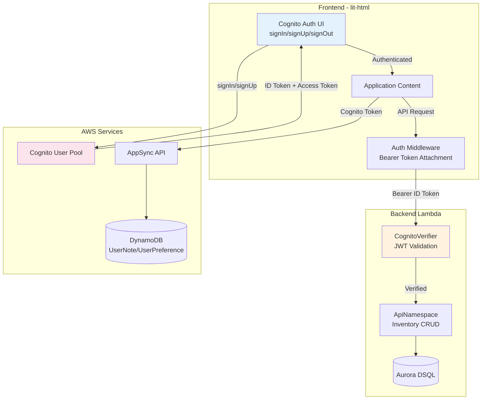
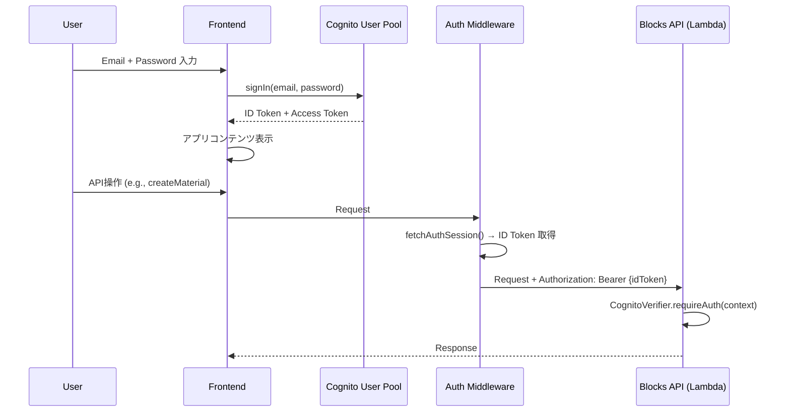
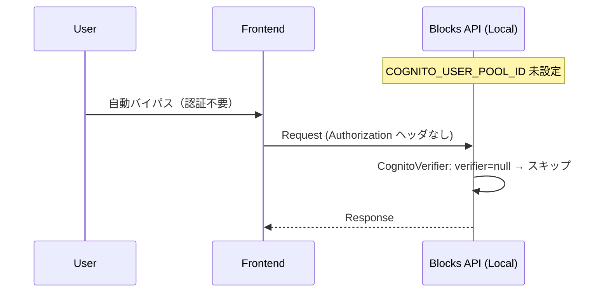

# Design Document: Cognito Auth Integration

## Overview

本設計は、資材在庫管理システムの認証を Blocks の `AuthBasic`（cookie ベース）から Amazon Cognito User Pool に移行するものである。移行後は、Blocks API（Aurora DSQL）と AppSync（DynamoDB の UserNote/UserPreference）の両方が同一の Cognito アイデンティティで動作する。

主な変更点:
1. **バックエンド**: `AuthBasic` を削除し、既存の `CognitoVerifier` を API コンテキストで直接使用する
2. **フロントエンド**: `AccountMenuBar`/`AuthenticatedContent` を Amplify Auth の `signIn`/`signUp`/`signOut` 関数 + lit-html による手動 UI に置換
3. **E2E テスト**: ローカルモードでは認証バイパス（env vars 未設定時）、sandbox モードでは Cognito テストユーザーで認証
4. **ローカル開発**: `COGNITO_USER_POOL_ID` 未設定時は全リクエスト許可（オープンアクセスモード）

## Architecture



### 認証フロー



### ローカル開発フロー



## Components and Interfaces

### 1. CognitoVerifier (バックエンド - 既存、変更なし)

`aws-blocks/cognito-verifier.ts` はすでに実装済み。API コンテキスト内で `requireAuth(context)` を呼び出す形に変更する。

```typescript
// 既存の CognitoVerifier インターフェース（変更なし）
interface CognitoVerifierConfig {
  userPoolId?: string;
  clientId?: string;
  region?: string;
}

class CognitoVerifier {
  requireAuth(context: { headers?: Record<string, string> }): Promise<void>;
}
```

### 2. ApiNamespace 認証統合 (バックエンド)

`aws-blocks/index.ts` の変更:
- `AuthBasic` の import と使用を削除
- `authApi` の export を削除
- 各 API メソッドの先頭で `cognitoAuth.requireAuth(context)` を呼び出す

```typescript
// Before
import { ApiNamespace, Scope, AuthBasic, ... } from '@aws-blocks/blocks';
const auth = new AuthBasic(scope, 'auth', { ... });
export const authApi = auth.createApi();

// After
import { ApiNamespace, Scope, ... } from '@aws-blocks/blocks';
// AuthBasic 削除、authApi export 削除

export const api = new ApiNamespace(scope, 'api', async (context) => {
  // 全 API メソッドの前に認証チェック
  await cognitoAuth.requireAuth(context);

  return {
    async createMaterial(input) { ... },
    async listMaterials() { ... },
    // ...
  };
});
```

**設計判断**: `requireAuth` を各メソッド内ではなくコンテキストコールバックの先頭で一度呼ぶことで、全 API が一律に保護される。個別メソッドで公開 API が必要になった場合は、メソッド単位で制御を移す。

### 3. Cognito Auth UI (フロントエンド)

React を使わないため、`aws-amplify/auth` の関数を直接呼び出し、lit-html でフォームをレンダリングする。

```typescript
// src/auth-ui.ts (新規)
import { signIn, signUp, signOut, confirmSignUp, getCurrentUser, fetchAuthSession } from 'aws-amplify/auth';
import { html, render } from 'lit-html';

type AuthView = 'signIn' | 'signUp' | 'confirmSignUp' | 'authenticated';

export function createAuthUI(container: HTMLElement, onAuthenticated: () => void): void;
export function renderSignInForm(container: HTMLElement): void;
export function renderSignUpForm(container: HTMLElement): void;
export function handleSignOut(): Promise<void>;
```

**状態遷移**:
```
signIn → (success) → authenticated
signIn → (UserNotConfirmedException) → confirmSignUp
signUp → confirmSignUp → signIn → authenticated
authenticated → signOut → signIn
```

### 4. Auth Middleware (フロントエンド - 既存を強化)

`src/index.ts` に既存の Auth Middleware をそのまま利用。ただし:
- `try/catch` で「aws-amplify not available」をフォールバックするパターンを維持（ローカル開発対応）
- セッション切れ時は fetchAuthSession が自動的にリフレッシュを試みる（Amplify SDK の標準動作）

```typescript
// 既存のミドルウェア構造を維持
registerMiddleware({
  async onRequest(req) {
    const session = await fetchAuthSession();
    const idToken = session.tokens?.idToken?.toString();
    if (idToken) {
      req.headers = { ...req.headers, authorization: `Bearer ${idToken}` };
    }
    return req;
  },
});
```

### 5. ローカル開発バイパス (フロントエンド)

`amplify_outputs.json` の `auth.user_pool_id` が存在しない場合、または `BLOCKS_DEV_MODE` 環境変数が設定されている場合、認証 UI をスキップして直接アプリコンテンツを表示する。

```typescript
// src/index.ts
const hasAuth = !!(outputs as any)?.auth?.user_pool_id;
if (hasAuth) {
  // Cognito Auth UI を表示
  createAuthUI(appContainer, () => renderApp());
} else {
  // ローカル開発: 直接アプリ表示
  renderApp();
}
```

### 6. E2E テスト認証

```typescript
// test/e2e.test.ts
// ローカルモード: authApi を使わない。CognitoVerifier がバイパスするため認証不要
// Sandbox モード: COGNITO_TEST_USER / COGNITO_TEST_PASSWORD env vars で signIn
test.before(async () => {
  if (process.env.COGNITO_TEST_USER) {
    // Sandbox: Cognito で認証
    const { signIn } = await import('aws-amplify/auth');
    await signIn({ username: process.env.COGNITO_TEST_USER, password: process.env.COGNITO_TEST_PASSWORD });
  }
  // ローカル: 何もしない（バイパスモード）
});
```

## Data Models

認証移行に伴う新規データモデルはない。既存のデータモデルはすべてそのまま使用する。

### 認証コンテキスト (ランタイム)

```typescript
// ApiNamespace context に含まれる headers
interface RequestContext {
  headers?: Record<string, string>;
  // authorization: "Bearer <cognito-id-token>"
}

// CognitoVerifier が検証する JWT クレーム
interface CognitoIdTokenClaims {
  sub: string;           // ユーザー ID
  email: string;         // メールアドレス
  aud: string;           // Client ID (COGNITO_CLIENT_ID と一致すべき)
  iss: string;           // Issuer URL
  token_use: 'id';       // トークン種別
  exp: number;           // 有効期限
  iat: number;           // 発行時刻
}
```

### Amplify 設定 (amplify_outputs.json)

```typescript
// 認証に関連するフィールド
interface AmplifyOutputsAuth {
  user_pool_id: string;
  aws_region: string;
  user_pool_client_id: string;
  identity_pool_id: string;
  username_attributes: string[];  // ["email"]
  password_policy: {
    min_length: number;
    require_lowercase: boolean;
    require_numbers: boolean;
    require_symbols: boolean;
    require_uppercase: boolean;
  };
}
```

## Correctness Properties

*A property is a characteristic or behavior that should hold true across all valid executions of a system — essentially, a formal statement about what the system should do. Properties serve as the bridge between human-readable specifications and machine-verifiable correctness guarantees.*

### Property 1: Local Development Bypass

*For any* request context (with any combination of headers, including missing Authorization header, malformed tokens, or valid tokens), when the CognitoVerifier is instantiated without a `userPoolId` (i.e., `COGNITO_USER_POOL_ID` is not set), `requireAuth()` SHALL resolve successfully without throwing.

**Validates: Requirements 3.4, 6.2, 7.1**

### Property 2: Valid Token Acceptance

*For any* cryptographically valid Cognito ID Token whose `aud` claim matches the configured `COGNITO_CLIENT_ID` and whose `token_use` is `'id'`, when passed as `Bearer {token}` in the Authorization header, `requireAuth()` SHALL resolve successfully without throwing.

**Validates: Requirements 3.1, 3.5**

### Property 3: Invalid Token Rejection

*For any* token that is either cryptographically invalid, expired, has a `token_use` other than `'id'`, or has an `aud` claim that does not match `COGNITO_CLIENT_ID`, when the CognitoVerifier is configured (env vars set), `requireAuth()` SHALL throw an error containing "Unauthorized".

**Validates: Requirements 3.2, 3.3, 3.5**

### Property 4: Middleware Token Attachment

*For any* authenticated Cognito session that yields a non-null ID token string, the Auth Middleware SHALL produce an outgoing request whose `authorization` header equals `"Bearer "` concatenated with that exact token string.

**Validates: Requirements 4.1**

## Error Handling

### バックエンド (CognitoVerifier)

| エラー条件 | レスポンス | HTTP ステータス |
|---|---|---|
| Authorization ヘッダーなし (cloud mode) | `Unauthorized: missing or invalid token` | 401 |
| トークン形式不正 | `Unauthorized: invalid token` | 401 |
| トークン期限切れ | `Unauthorized: invalid token` | 401 |
| audience 不一致 | `Unauthorized: invalid token` | 401 |
| ローカルモード (env vars 未設定) | — (エラーなし、通過) | — |

### フロントエンド (Auth UI)

| エラー条件 | ユーザー表示 | 挙動 |
|---|---|---|
| 不正なメールアドレス形式 | フォームバリデーションエラー | サブミット阻止 |
| パスワードがポリシー違反 | Cognito エラーメッセージ表示 | フォームに表示 |
| ユーザーが存在しない | `User does not exist` | サインアップへ誘導 |
| メール未確認 | 確認コード入力画面へ遷移 | confirmSignUp フローへ |
| セッション期限切れ | 自動リフレッシュ試行 → 失敗時サインイン画面 | fetchAuthSession() による自動処理 |
| ネットワークエラー | エラーメッセージ表示 | リトライボタン提供 |

### フロントエンド (Auth Middleware)

| エラー条件 | 挙動 |
|---|---|
| fetchAuthSession() 失敗 | トークンなしでリクエスト送信（バックエンドで 401） |
| ID Token が null (未認証) | ヘッダー付与なし |
| aws-amplify モジュール未利用可 | ミドルウェア登録スキップ |

## Testing Strategy

### テストレベル

| レベル | ツール | 対象 |
|---|---|---|
| Property-based test | fast-check | CognitoVerifier のバイパス/検証ロジック、Middleware のトークン付与 |
| E2E test | node:test + api client | 全 API 操作（ローカルモードで認証バイパス） |
| Integration test (sandbox) | node:test + Cognito | sandbox 環境での実 Cognito フロー |

### Property-Based Testing

`fast-check` を使用し、各プロパティに対して最低 100 回のイテレーションを実行する。

```typescript
// テストファイル: test/auth-properties.test.ts
import fc from 'fast-check';

// Property 1: Local dev bypass
// Feature: cognito-auth-integration, Property 1: Local Development Bypass
fc.assert(fc.asyncProperty(
  fc.record({ authorization: fc.option(fc.string()) }),
  async (headers) => {
    const verifier = new CognitoVerifier({}); // no userPoolId
    await verifier.requireAuth({ headers }); // should not throw
  }
), { numRuns: 100 });
```

### E2E テスト戦略

- **ローカルモード** (`npm run test:e2e`): `COGNITO_USER_POOL_ID` 未設定のため認証バイパス。既存の 41 テストは authApi 関連テストを削除/修正した上で全て通過する
- **Sandbox モード**: `COGNITO_TEST_USER` / `COGNITO_TEST_PASSWORD` 環境変数で実 Cognito 認証を行う

### ユニットテスト

- CognitoVerifier のコンストラクタ分岐（env vars あり/なし）
- Auth Middleware のトークン付与（モック fetchAuthSession）
- フロントエンド Auth UI の状態遷移（signIn → authenticated, signUp → confirmSignUp → signIn）
