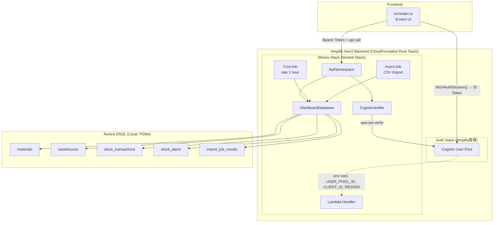
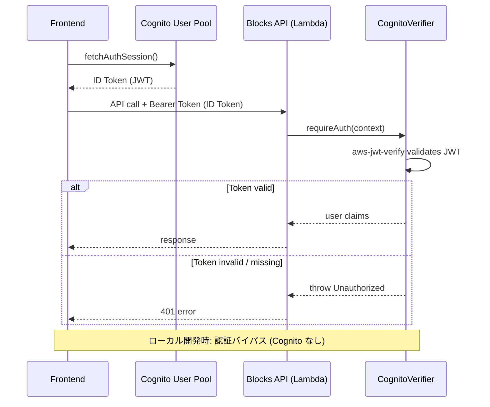
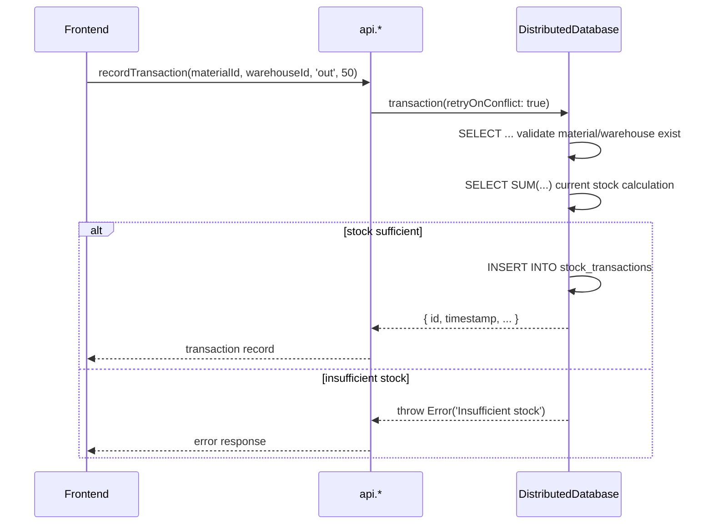
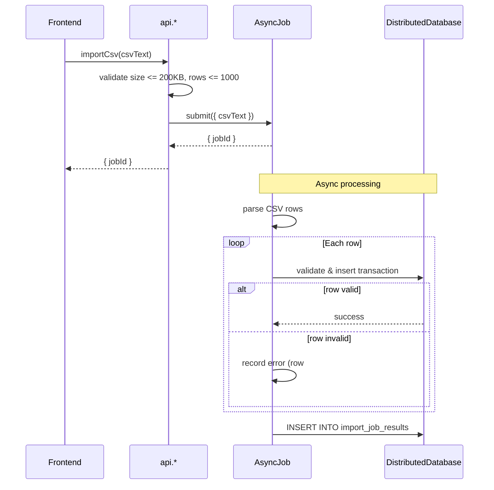
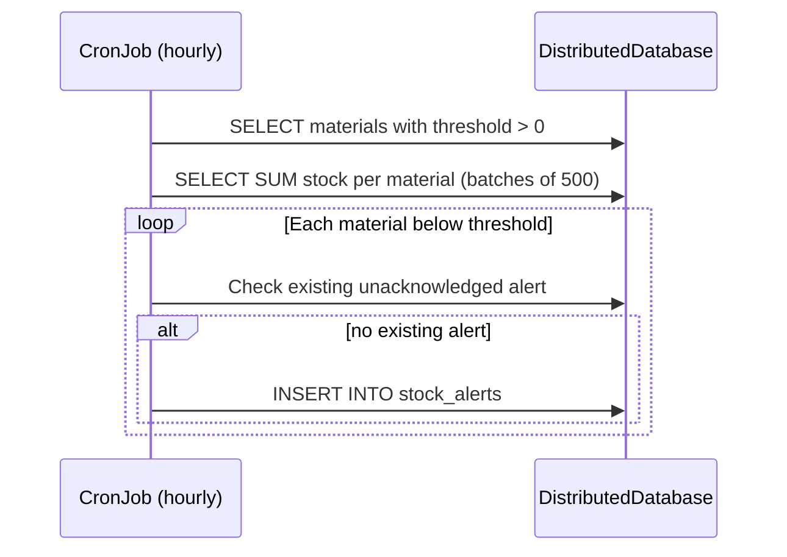
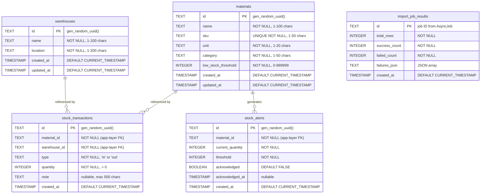

# Design Document: Inventory Management (資材在庫管理)

## Overview

本設計は、AWS Blocks の `DistributedDatabase` (Aurora DSQL)、`CronJob`、`AsyncJob` を活用した資材在庫管理システムのバックエンド・フロントエンド実装の技術設計である。Amplify Gen2 と統合し、Cognito による認証基盤と Amplify Hosting によるデプロイパイプラインを利用する。

### 設計方針

- **単一ファイルバックエンド**: `aws-blocks/index.ts` に全 API・Block 定義を集約
- **Amplify Gen2 統合**: Blocks バックエンドを Amplify の Nested Stack として管理
- **Cognito 認証**: Amplify 管理の Cognito User Pool を認証基盤として使用し、`CognitoVerifier` ヘルパーで JWT を検証
- **SQL ファースト**: DistributedDatabase で SQL マイグレーション + パラメータバインディング
- **アプリケーション層での整合性担保**: DSQL は FK 非対応のため、参照整合性チェックを API ロジックで実装
- **OCC リトライ**: トランザクション競合時は `retryOnConflict: true` で自動リトライ
- **テスト駆動**: 全機能を `npm run test:e2e` で検証可能にする
- **ローカル開発時は認証バイパス**: Cognito はクラウド上でのみ有効。ローカルサーバーでは認証スキップ

## Architecture

### System Architecture Diagram



### Authentication Flow



### Data Flow: Stock Transaction



### Data Flow: CSV Import



### Data Flow: Low-Stock Alert (CronJob)



## Components and Interfaces

### Block Declarations

```typescript
// aws-blocks/index.ts

import { ApiNamespace, Scope, DistributedDatabase, sql } from '@aws-blocks/blocks';
import { CronJob } from '@aws-blocks/bb-cron-job';
import { AsyncJob } from '@aws-blocks/bb-async-job';
import { CognitoVerifier } from './cognito-verifier.js';

const scope = new Scope('inventory');

// Cognito 認証 (デプロイ時のみ有効、ローカルではバイパス)
const auth = new CognitoVerifier({
  userPoolId: process.env.COGNITO_USER_POOL_ID,
  clientId: process.env.COGNITO_CLIENT_ID,
  region: process.env.COGNITO_REGION,
});

const db = new DistributedDatabase(scope, 'main', {
  migrationsPath: './aws-blocks/dsql-migrations',
});
```

### CognitoVerifier Helper

```typescript
// aws-blocks/cognito-verifier.ts

import { CognitoJwtVerifier } from 'aws-jwt-verify';

interface CognitoVerifierConfig {
  userPoolId?: string;
  clientId?: string;
  region?: string;
}

export class CognitoVerifier {
  private verifier: ReturnType<typeof CognitoJwtVerifier.create> | null = null;

  constructor(private config: CognitoVerifierConfig) {
    if (config.userPoolId && config.clientId) {
      this.verifier = CognitoJwtVerifier.create({
        userPoolId: config.userPoolId,
        tokenUse: 'id',
        clientId: config.clientId,
      });
    }
  }

  async requireAuth(context: { headers?: Record<string, string> }): Promise<void> {
    // ローカル開発時 (env vars 未設定) は認証スキップ
    if (!this.verifier) return;

    const authHeader = context.headers?.authorization;
    if (!authHeader?.startsWith('Bearer ')) {
      throw new Error('Unauthorized: missing or invalid token');
    }

    const token = authHeader.slice(7);
    try {
      await this.verifier.verify(token);
    } catch (err) {
      throw new Error('Unauthorized: invalid token');
    }
  }
}
```

### API Interface Design

```typescript
export const api = new ApiNamespace(scope, 'api', (context) => ({
  // ─── Materials CRUD ───────────────────────────────────────────
  createMaterial(input: {
    name: string;        // 1-100 chars
    sku: string;         // 1-50 chars, alphanumeric + hyphens
    unit: string;        // 1-20 chars
    category: string;    // 1-50 chars
    lowStockThreshold: number; // 0-999999
  }): Promise<Material>;

  listMaterials(): Promise<Material[]>; // max 200, ordered by name ASC

  updateMaterial(id: string, input: {
    name?: string;
    unit?: string;
    category?: string;
    lowStockThreshold?: number;
  }): Promise<Material>;

  deleteMaterial(id: string): Promise<{ id: string }>;

  // ─── Warehouses CRUD ──────────────────────────────────────────
  createWarehouse(input: {
    name: string;     // 1-100 chars
    location: string; // 1-200 chars
  }): Promise<Warehouse>;

  listWarehouses(): Promise<Warehouse[]>; // ordered by name ASC

  updateWarehouse(id: string, input: {
    name?: string;
    location?: string;
  }): Promise<Warehouse>;

  deleteWarehouse(id: string): Promise<{ id: string }>;

  // ─── Stock Transactions ───────────────────────────────────────
  recordTransaction(input: {
    materialId: string;
    warehouseId: string;
    type: 'in' | 'out';
    quantity: number;    // 1-999999
    note?: string;       // max 500 chars
  }): Promise<StockTransaction>;

  listTransactions(
    materialId: string,
    warehouseId: string
  ): Promise<StockTransaction[]>; // max 100, ordered by timestamp DESC

  // ─── Stock Inquiry ────────────────────────────────────────────
  getCurrentStock(filter?: {
    materialId?: string;
    warehouseId?: string;
  }): Promise<CurrentStockEntry[]>; // max 1000, ordered by material name ASC

  getStockSummary(): Promise<StockSummaryEntry[]>; // grouped by material

  // ─── Alerts ───────────────────────────────────────────────────
  listAlerts(cursor?: string): Promise<{
    alerts: StockAlert[];
    nextCursor?: string;
  }>; // max 100 per page, ordered by timestamp DESC

  acknowledgeAlert(alertId: string): Promise<{ id: string }>;

  // ─── CSV Import ───────────────────────────────────────────────
  importCsv(csvText: string): Promise<{ jobId: string }>;

  getImportJobResult(jobId: string): Promise<ImportJobResult>;
}));
```

### Type Definitions

```typescript
interface Material {
  id: string;           // UUID
  name: string;
  sku: string;
  unit: string;
  category: string;
  lowStockThreshold: number;
  createdAt: string;    // ISO 8601
  updatedAt: string;    // ISO 8601
}

interface Warehouse {
  id: string;           // UUID
  name: string;
  location: string;
  createdAt: string;
  updatedAt: string;
}

interface StockTransaction {
  id: string;           // UUID
  materialId: string;
  warehouseId: string;
  type: 'in' | 'out';
  quantity: number;
  note: string | null;
  createdAt: string;    // ISO 8601
}

interface CurrentStockEntry {
  materialId: string;
  materialName: string;
  materialSku: string;
  warehouseId: string;
  warehouseName: string;
  quantity: number;
}

interface StockSummaryEntry {
  materialId: string;
  materialName: string;
  materialSku: string;
  totalQuantity: number;
}

interface StockAlert {
  id: string;           // UUID
  materialId: string;
  materialName: string;
  currentQuantity: number;
  threshold: number;
  acknowledged: boolean;
  acknowledgedAt: string | null;
  createdAt: string;
}

interface ImportJobResult {
  jobId: string;
  totalRows: number;
  successCount: number;
  failedCount: number;
  failures: Array<{
    row: number;
    error: string;
  }>;
  createdAt: string;
}
```

### CronJob: Low-Stock Alert Check

```typescript
const lowStockCheck = new CronJob(scope, 'low-stock-check', {
  schedule: 'rate(1 hour)',
  handler: async (event) => {
    // 1. Fetch materials with threshold > 0 (batch of 500)
    // 2. For each, calculate total stock across all warehouses
    // 3. If stock <= threshold AND no unacknowledged alert exists, create alert
  },
});
```

### AsyncJob: CSV Import

```typescript
const csvImportJob = new AsyncJob(scope, 'csv-import', {
  handler: async (payload: { csvText: string; jobId: string }, ctx) => {
    // 1. Parse CSV (skip header)
    // 2. For each row: validate, lookup SKU/warehouse, apply stock rules
    // 3. Record successes and failures
    // 4. Store ImportJobResult in DB
  },
});
```

## Data Models

### Entity-Relationship Diagram



### SQL Migration Files

**`aws-blocks/dsql-migrations/0001_create_materials.sql`**
```sql
CREATE TABLE materials (
  id TEXT PRIMARY KEY DEFAULT gen_random_uuid(),
  name TEXT NOT NULL,
  sku TEXT UNIQUE NOT NULL,
  unit TEXT NOT NULL,
  category TEXT NOT NULL,
  low_stock_threshold INTEGER NOT NULL DEFAULT 0,
  created_at TIMESTAMP DEFAULT CURRENT_TIMESTAMP,
  updated_at TIMESTAMP DEFAULT CURRENT_TIMESTAMP
);
```

**`aws-blocks/dsql-migrations/0002_create_warehouses.sql`**
```sql
CREATE TABLE warehouses (
  id TEXT PRIMARY KEY DEFAULT gen_random_uuid(),
  name TEXT NOT NULL,
  location TEXT NOT NULL,
  created_at TIMESTAMP DEFAULT CURRENT_TIMESTAMP,
  updated_at TIMESTAMP DEFAULT CURRENT_TIMESTAMP
);
```

**`aws-blocks/dsql-migrations/0003_create_stock_transactions.sql`**
```sql
CREATE TABLE stock_transactions (
  id TEXT PRIMARY KEY DEFAULT gen_random_uuid(),
  material_id TEXT NOT NULL,
  warehouse_id TEXT NOT NULL,
  type TEXT NOT NULL,
  quantity INTEGER NOT NULL,
  note TEXT,
  created_at TIMESTAMP DEFAULT CURRENT_TIMESTAMP
);
```

**`aws-blocks/dsql-migrations/0004_create_stock_alerts.sql`**
```sql
CREATE TABLE stock_alerts (
  id TEXT PRIMARY KEY DEFAULT gen_random_uuid(),
  material_id TEXT NOT NULL,
  current_quantity INTEGER NOT NULL,
  threshold INTEGER NOT NULL,
  acknowledged BOOLEAN NOT NULL DEFAULT FALSE,
  acknowledged_at TIMESTAMP,
  created_at TIMESTAMP DEFAULT CURRENT_TIMESTAMP
);
```

**`aws-blocks/dsql-migrations/0005_create_import_job_results.sql`**
```sql
CREATE TABLE import_job_results (
  id TEXT PRIMARY KEY,
  total_rows INTEGER NOT NULL,
  success_count INTEGER NOT NULL,
  failed_count INTEGER NOT NULL,
  failures_json TEXT NOT NULL DEFAULT '[]',
  created_at TIMESTAMP DEFAULT CURRENT_TIMESTAMP
);
```

**`aws-blocks/dsql-migrations/0006_create_indexes.sql`**
```sql
CREATE INDEX idx_materials_sku ON materials(sku);
```

**`aws-blocks/dsql-migrations/0007_create_transaction_indexes.sql`**
```sql
CREATE INDEX idx_stock_transactions_material_warehouse ON stock_transactions(material_id, warehouse_id);
```

**`aws-blocks/dsql-migrations/0008_create_alert_indexes.sql`**
```sql
CREATE INDEX idx_stock_alerts_timestamp ON stock_alerts(created_at DESC);
```

**設計決定:**
- 1 DDL ステートメント = 1 マイグレーションファイル (DSQL 制約)
- `updated_at` は materials/warehouses のみ (transactions/alerts は不変レコード)
- `failures_json` は TEXT 型で JSON 文字列を格納 (DSQL は JSONB に制限あり)
- インデックスは通常の `CREATE INDEX` を使用 (小規模テーブルのため `ASYNC` 不要)

### Key Query Patterns

**現在庫の算出:**
```sql
SELECT
  m.id AS material_id,
  m.name AS material_name,
  m.sku AS material_sku,
  w.id AS warehouse_id,
  w.name AS warehouse_name,
  SUM(CASE WHEN st.type = 'in' THEN st.quantity ELSE -st.quantity END) AS quantity
FROM stock_transactions st
JOIN materials m ON m.id = st.material_id
JOIN warehouses w ON w.id = st.warehouse_id
WHERE ($1::TEXT IS NULL OR st.warehouse_id = $1)
  AND ($2::TEXT IS NULL OR st.material_id = $2)
GROUP BY m.id, m.name, m.sku, w.id, w.name
ORDER BY m.name ASC
LIMIT 1000
```

**在庫不足チェック (CronJob):**
```sql
SELECT
  m.id,
  m.name,
  m.low_stock_threshold,
  COALESCE(SUM(CASE WHEN st.type = 'in' THEN st.quantity ELSE -st.quantity END), 0) AS total_stock
FROM materials m
LEFT JOIN stock_transactions st ON st.material_id = m.id
WHERE m.low_stock_threshold > 0
GROUP BY m.id, m.name, m.low_stock_threshold
HAVING COALESCE(SUM(CASE WHEN st.type = 'in' THEN st.quantity ELSE -st.quantity END), 0) <= m.low_stock_threshold
LIMIT 500
```

## Amplify Gen2 Integration

### Project Structure (amplify/ directory)

```
amplify/
├── auth/
│   └── resource.ts          ← Cognito User Pool 定義 (Amplify 標準)
├── backend.ts               ← Amplify バックエンド定義 + Blocks 統合
├── blocks.ts                ← Amplify-Blocks 統合ロジック
├── package.json             ← amplify/ 用の依存パッケージ
└── tsconfig.json            ← amplify/ 用 TypeScript 設定
```

### backend.ts

```typescript
import { defineBackend } from '@aws-amplify/backend';
import { auth } from './auth/resource';
import { initBlocks } from './blocks.js';

export const backend = defineBackend({ auth });

await initBlocks(backend);
```

### blocks.ts — Amplify-Blocks 統合

```typescript
import type { defineBackend } from '@aws-amplify/backend';
import { BlocksBackend } from 'aws-blocks/cdk';
import * as path from 'path';

export async function initBlocks(backend: ReturnType<typeof defineBackend>) {
  // Blocks を Amplify の Nested Stack として作成
  const blocksStack = backend.createStack('blocks');

  // Blocks CDK Construct をデプロイ
  const blocksBackend = new BlocksBackend(blocksStack, 'inventory', {
    entry: path.resolve(__dirname, '../aws-blocks/index.cdk.ts'),
  });

  // Cognito 環境変数を Blocks Lambda に注入
  const userPool = backend.auth.resources.userPool;
  const userPoolClient = backend.auth.resources.userPoolClient;

  blocksBackend.handler.addEnvironment('COGNITO_USER_POOL_ID', userPool.userPoolId);
  blocksBackend.handler.addEnvironment('COGNITO_CLIENT_ID', userPoolClient.userPoolClientId);
  blocksBackend.handler.addEnvironment('COGNITO_REGION', blocksStack.region);

  // Blocks API URL を amplify_outputs.json に出力
  backend.addOutput({
    custom: {
      blocks_api_url: blocksBackend.apiUrl,
    },
  });
}
```

### auth/resource.ts

```typescript
import { defineAuth } from '@aws-amplify/backend';

export const auth = defineAuth({
  loginWith: {
    email: true,
  },
});
```

### Frontend Authentication Middleware

```typescript
// src/index.ts (フロントエンド) — Cognito トークン自動付与

import { fetchAuthSession } from 'aws-amplify/auth';
import { registerMiddleware } from 'aws-blocks/client';

// Amplify Cognito トークンを自動で Bearer ヘッダーに付与
registerMiddleware(async (request) => {
  try {
    const session = await fetchAuthSession();
    const idToken = session.tokens?.idToken?.toString();
    if (idToken) {
      request.headers = {
        ...request.headers,
        authorization: `Bearer ${idToken}`,
      };
    }
  } catch {
    // 未認証の場合はトークンなしで続行 (ローカル開発時)
  }
  return request;
});
```

### Deployment Flow

| 環境 | コマンド | 動作 |
|------|---------|------|
| ローカル開発 | `npm run dev` | Blocks ローカルサーバー (認証バイパス、PGlite) |
| クラウド Sandbox | `npx ampx sandbox` | Amplify + Blocks を個人 Sandbox にデプロイ |
| 本番デプロイ | Amplify Hosting Console | Git push → 自動デプロイ |

### Local vs Cloud の差異

| 項目 | ローカル (`npm run dev`) | クラウド (`npx ampx sandbox`) |
|------|-------------------------|-------------------------------|
| 認証 | バイパス (env vars なし) | Cognito JWT 検証 |
| DB | PGlite (インメモリ) | Aurora DSQL |
| CronJob | 手動トリガー / テスト呼び出し | EventBridge で定期実行 |
| AsyncJob | ローカルキュー | SQS → Lambda |

## Correctness Properties

*A property is a characteristic or behavior that should hold true across all valid executions of a system — essentially, a formal statement about what the system should do. Properties serve as the bridge between human-readable specifications and machine-verifiable correctness guarantees.*

### Property 1: Material creation round-trip

*For any* valid material input (name 1-100 chars, SKU 1-50 chars alphanumeric/hyphens, unit 1-20 chars, category 1-50 chars, threshold 0-999999), creating a material and then retrieving it should return a record containing all the provided fields, a valid UUID, and a timestamp.

**Validates: Requirements 1.1**

### Property 2: Material list ordering

*For any* set of materials with distinct names, listing materials should return them in ascending alphabetical order by name.

**Validates: Requirements 1.2**

### Property 3: SKU uniqueness enforcement

*For any* valid SKU code, creating a material with that SKU and then attempting to create another material with the same SKU should result in the second creation being rejected with a duplicate error.

**Validates: Requirements 1.5**

### Property 4: Input validation rejects invalid materials

*For any* material input where at least one field violates its constraints (empty name, SKU > 50 chars, threshold < 0 or > 999999, etc.), the API should reject the creation and return a validation error.

**Validates: Requirements 1.7**

### Property 5: Warehouse list ordering

*For any* set of warehouses with distinct names, listing warehouses should return them in ascending alphabetical order by name.

**Validates: Requirements 2.2**

### Property 6: Warehouse input validation

*For any* warehouse input where name or location is empty or exceeds maximum length, the API should reject the creation and return a validation error.

**Validates: Requirements 2.6**

### Property 7: Stock aggregation correctness

*For any* sequence of stock-in and stock-out transactions for a given material-warehouse pair, the current stock should equal the sum of all in-quantities minus the sum of all out-quantities.

**Validates: Requirements 3.3, 4.1**

### Property 8: Stock never goes negative

*For any* material-warehouse pair with current stock N, attempting a stock-out transaction with quantity greater than N should be rejected with an insufficient stock error, and the current stock should remain N.

**Validates: Requirements 3.4**

### Property 9: Quantity validation

*For any* quantity value that is not a positive integer or exceeds 999,999, the API should reject the stock transaction and return a validation error.

**Validates: Requirements 3.2**

### Property 10: Stock inquiry filter correctness

*For any* filter parameter (materialId or warehouseId), all entries in the current stock response should match the specified filter — no entry should reference a different material or warehouse.

**Validates: Requirements 4.2, 4.3**

### Property 11: Stock summary cross-warehouse aggregation

*For any* material with transactions across multiple warehouses, the stock summary total should equal the sum of current stock across all warehouses for that material.

**Validates: Requirements 4.5**

### Property 12: Low-stock alert generation correctness

*For any* material whose total stock (across all warehouses) is at or below its low_stock_threshold (> 0), and for which no unacknowledged alert exists, the CronJob handler should create exactly one alert.

**Validates: Requirements 5.2, 5.3**

### Property 13: Low-stock alert idempotency

*For any* material already below threshold with an existing unacknowledged alert, running the CronJob handler again should NOT create a duplicate alert.

**Validates: Requirements 5.3**

### Property 14: CSV size/row limit enforcement

*For any* CSV text exceeding 200KB in size or containing more than 1000 data rows, the import API should reject the request without enqueuing a job.

**Validates: Requirements 6.2**

### Property 15: CSV import partial success

*For any* CSV containing a mix of valid and invalid rows (non-existent SKU, insufficient stock, malformed values), the handler should process all rows — creating transactions for valid rows and recording errors (with row number and description) for invalid rows — without stopping early.

**Validates: Requirements 6.6, 6.7, 6.8**

### Property 16: CSV import result completeness

*For any* completed CSV import job, the stored result should contain totalRows equal to the number of data rows in the CSV, successCount + failedCount equal to totalRows, and each failure entry should reference a valid row number.

**Validates: Requirements 6.9**

## Error Handling

### Error Response Strategy

全 API メソッドは失敗時に `Error` を throw する。Blocks の JSON-RPC トランスポートがこれを構造化エラーレスポンスに変換する。

| Error Category | Message Pattern | HTTP-equivalent |
|---|---|---|
| Validation | `"Validation error: {field} {reason}"` | 400 |
| Not Found | `"Material not found"` / `"Warehouse not found"` | 404 |
| Conflict | `"SKU already exists: {sku}"` | 409 |
| Business Rule | `"Insufficient stock: available {n}"` | 422 |
| Concurrency | `"Temporary conflict, please retry"` | 503 |

### OCC Retry Strategy

```typescript
await db.transaction(async (tx) => {
  // stock validation + insert
}, { retryOnConflict: true, maxRetries: 3 });
```

- DistributedDatabase の `retryOnConflict` オプションを使用
- 3回リトライ後も失敗した場合は "Temporary conflict" エラーを返す
- リトライ内では外部副作用 (メール送信等) を行わない

### CSV Import Error Handling

- 行単位でエラーをキャッチし、`failures` 配列に蓄積
- 1行のエラーが他の行の処理を止めない
- 全行処理後に結果を `import_job_results` テーブルに保存

### Referential Integrity (Application-Layer)

DSQL は FK 非対応のため、以下をアプリケーション層で検証:

1. `recordTransaction`: materialId と warehouseId の存在チェック (`SELECT` で事前確認)
2. `deleteWarehouse`: stock_transactions での参照チェック (`SELECT COUNT(*)`)
3. `deleteMaterial`: 削除前の参照チェック (stock_transactions に存在する場合は要検討 — 要件では明記されていないが、warehouse 同様に保護する)

## Testing Strategy

### 方針

- **Property-based tests**: ビジネスロジックの不変条件を 100+ イテレーションでランダム入力により検証
- **Example-based E2E tests** (`test/e2e.test.ts`): 具体的なシナリオで API の動作を検証
- **テストフレームワーク**: Node.js 組み込みの `node:test` + `node:assert`
- **Property-based testing library**: `fast-check` (TypeScript 対応の PBT ライブラリ)
- **認証**: ローカルテスト時は認証バイパス (Cognito 環境変数なし)。Sandbox テスト時は Cognito トークン取得が必要

### Property-Based Testing Configuration

- 最低 100 イテレーション per property
- 各テストにプロパティ番号をタグ付け
- タグフォーマット: `Feature: inventory-management, Property {number}: {property_text}`

### E2E Test Coverage (Example-Based)

| テストケース | 検証内容 |
|---|---|
| Material CRUD | 作成 → 一覧確認 → 更新 → 削除 → 一覧から消失 |
| Warehouse CRUD | 作成 → 一覧確認 → 更新 → 削除 → 一覧から消失 |
| Stock-in transaction | 入庫 → 在庫照会で数量確認 |
| Stock-out rejection | 在庫超過の出庫 → エラー確認 |
| CSV import (valid + invalid rows) | 結果に success/failed カウント + failure entries |
| Low-stock alert | CronJob ハンドラ直接実行 → アラート生成確認 |
| Alert acknowledgment | アラート確認 → acknowledged フラグ更新 |

### テスト実行

```bash
# ローカル開発 (認証バイパス)
npm run test:e2e

# Sandbox 統合テスト (Cognito 認証あり)
npx ampx sandbox
npm run test:e2e:sandbox
```

- ローカルテスト: Blocks ローカルサーバーを自動起動 (未起動の場合)、認証なし
- Sandbox テスト: Amplify Sandbox にデプロイ済みの環境に対して実行、Cognito トークン使用
- 各テストは独自のテストデータを生成し、実行順に依存しない
- `api.*` メソッドを型付きクライアント経由で呼び出し
